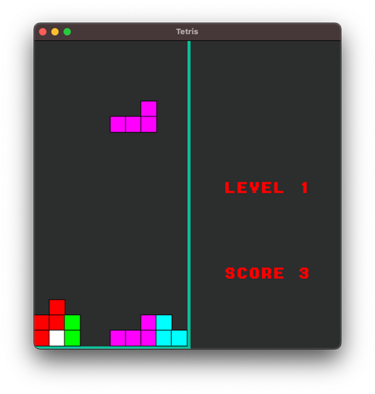

# Tetris Game



## Описание

Этот проект представляет собой реализацию классической игры Тетрис на языке программирования C++ с использованием библиотеки SFML.

## Особенности

- Реализованы все основные механики игры Тетрис, включая падение фигур, их поворот, заполнение линий и очистку.
- Графический интерфейс пользователя создан с использованием библиотеки SFML, что позволяет насладиться приятной визуальной атмосферой игры.
- Реализованы звуковые эффекты для усиления атмосферы игры.

## Инструкции по установке и запуску

1. Убедитесь, что у вас установлен компилятор C++ и библиотека SFML.
2. Склонируйте репозиторий на свой компьютер:
   
   ```bash
   $ git clone https://github.com/ikolbeko/Tetris-Game.git
   ```
3. Перейдите в каталог проекта:
   
   ```bash
   $ cd tetris
   ```
4. Соберите проект с помощью компилятора C++ (пример для g++):
   
   ```bash
   $ g++ -o tetris main.cpp -lsfml-graphics -lsfml-window -lsfml-system
   ```
5. Запустите игру:
   
   ```bash
   $ ./tetris
   ```

## Автор

Эта игра была разработана в рамках курсового проекта второго курса. Автор: Илья Колбеко.